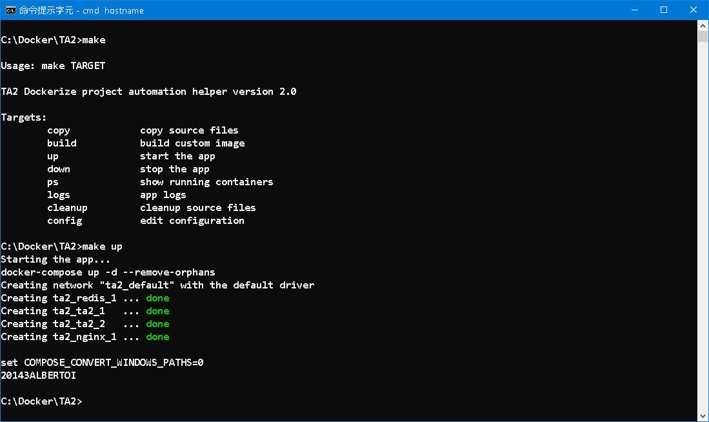

# Deploy ASP.NET 4.5 Webform Application to multi-containers Docker environment
 ─── 「路漫漫其修遠兮， 吾將上下而求索。」

This article briefly describes the moving of an [ASP.NET Web Forms](https://en.wikipedia.org/wiki/ASP.NET_Web_Forms) application to Docker environment. At present, windows containers are still in *experimental* stage, fore sure more issues come up when one goes deeper to Docker land. 

## I. The Hypervisor 

The first step towards windows containers is to install [Docker Desktop on Windows](https://docs.docker.com/desktop/windows/install/), which requires [Hyper-V](https://docs.microsoft.com/en-us/virtualization/hyper-v-on-windows/about/) feature enabled. Since Hyper-V is [Hypervisor Type 1](https://www.hitechnectar.com/blogs/hypervisor-type-1-vs-type-2/), by installing Hyper-V also means that you can not run other virtualization softwares such as VMWare and VirtualBox (Hypervisor Type 2). 


Once installed you can switch between running Linux or Windows containers, when are done with these container things... 


Note: Starting Version 6.1.4, [VirtualBox](https://www.virtualbox.org/wiki/Changelog) restores the ability to run VMs through Hyper-V, at the expense of performance. That means it uses *simulation* to execute virtual machine. 

## II. .NET Framework 4.8 and Session Provider

[.NET Framework](https://en.wikipedia.org/wiki/.NET_Framework) version 4.8 is supposed to be the latest and last version framework *compatible* with Webform development model. Due to the intrinsic performance and overhead deficiency of Webform, Microsoft has abandoned and successfully **RE-USE** the term '.NET Framework' to represent the new '.NET Core' development model. 

Basically, .NET Framework and .NET Core are completely different development models. .NET Framework 4.8 and before are Webform model, which makes use of *view state* to alleviate the pain in http Web development. .NET Core is [Model–view–controller](https://en.wikipedia.org/wiki/Model%E2%80%93view%E2%80%93controller) aka MVC model, no view state, no .aspx and no code behind page. It is impossible to to convert or migrate from Webform to MVC, every pages have to be  completely re-written. In addition, Webform applications must be exected on [Internet Information Services](https://en.wikipedia.org/wiki/Internet_Information_Services) aka IIS; IIS must be executed on Windows, which in turn binds Webform applications on Windows platform. Moving to .NET Core is painful for most Webform developers, the gains are performance, multi-platforms and Docker. 

`Dockerizing .NET Webform application is difficult but possible`, and that's what i am doing now.
If you are not using the latest version of Framework, the first step would be upgrading your project. In Solution Explorer, right-click on you project and choose 'Properties', 'Target framework': 


choose  by '.NET Framework 4.8', save, rebuild and test the project. 

In Solution Explorer, right-click on your project and choose 'Manage NuGet Package...', 'Browse'. We are going to store session out-proc in [Redis](https://redis.io/) Cache. You need the “Microsoft.Web.RedisSessionStateProvider” package: 


You may also install need "ServiceStack.Redis" package if you need other Redis features. Save, edit web.config as follow, rebuild and test the project. 


Note: `20143ALBERTOI` is the target machine hosting Redis Server. 

## III. Nginx and Redis

Setting up [Nginx](http://nginx.org/en/download.html) as reverse proxy is not difficult, many tutorials and videos exist from the internet. To dockerize everything, I use a custom-built **'nginx:1.20.2-servercore-ltsc2019'** image for Nginx Server. To config the reverse proxy, edit the nginx.conf as follow: 

```console
events {
  worker_connections  4096;  ## Default: 1024
}
http {
	server {
			listen   80;
			server_name 20143albertoi;

			location / {
					proxy_set_header X-Real-IP $remote_addr;
					proxy_set_header X-Forwarded-For $proxy_add_x_forwarded_for;
					
					proxy_set_header Host $host;
					proxy_set_header X-NginX-Proxy true;
					proxy_pass http://ta2;
					proxy_redirect off;
			}
	}
}
```
It tells Nginx to listen to port 80 and forward the request to 'http://ta2', which is the web application. Following is code fragment from docker-compose.yml: 

```console
  nginx:
    image: 
      ${NGINX_IMAGE_NAME}:${NGINX_IMAGE_VERSION}
    ports:
      - "8080:80"
    volumes:
      - ${NGINX_CONF_DIR}:C:\nginx\conf
    depends_on:
      - ta2
```
*Just one more thing, as far as i have tested, Docker on windows does not allow you to bind a single into container. You have to bind the whole folder.*

Setting up [Redis](https://redis.io/) is a breeze, many tutorials and videos exist from the internet. To dockerize everything, I use a custom-built **'redis:3.2.100-nanoserver-1909'** image for Redis Server. Following is code fragment from docker-compose.yml: 

```console
  redis: 
    image:
      ${REDIS_IMAGE_NAME}:${REDIS_IMAGE_VERSION}
    ports:
      - "6379:6379"
    volumes:
      - ${REDIS_DATA_DIR}:C:\data
```

## IV. Dockerfile

The [Dockerfile](https://docs.docker.com/engine/reference/builder/) is from [ASP.NET Docker Sample](https://github.com/microsoft/dotnet-framework-docker/blob/main/samples/aspnetapp/README.md#view-the-aspnet-app-in-a-running-container-on-windows)

```console
FROM mcr.microsoft.com/dotnet/framework/sdk:4.8 AS build
WORKDIR /app

# copy csproj and restore as distinct layers
COPY *.sln .
COPY aspnetapp/*.csproj ./aspnetapp/
COPY aspnetapp/*.config ./aspnetapp/
RUN nuget restore

# copy everything else and build app
COPY aspnetapp/. ./aspnetapp/
WORKDIR /app/aspnetapp
RUN msbuild /p:Configuration=Release -r:False


FROM mcr.microsoft.com/dotnet/framework/aspnet:4.8 AS runtime
WORKDIR /inetpub/wwwroot
COPY --from=build /app/aspnetapp/. ./
```
A multi-stage build dockerfile, which uses **'mcr.microsoft.com/dotnet/framework/sdk:4.8'** (built time) and **'mcr.microsoft.com/dotnet/framework/aspnet:4.8'** (run time), has set a good example to learn how to build images. 

Of course, you need .dockerignore to cooperate the build process. 
```console
# directories
**/packages/
**/bin/
**/obj/
**/out/

# files
Dockerfile*
**/*.trx
**/*.md
```
Note: Use **'mcr.microsoft.com/dotnet/framework/aspnet:4.8-windowsservercore-ltsc2019 AS runtime'** as runtime significantly reduce image size. 


Following is code fragment from docker-compose.yml: 

```console
  ta2:
    build: 
      context: .
    image: 
      ${TA2_IMAGE_NAME}:${TA2_IMAGE_VERSION}
    volumes:
      - ${TA2_LOG_DIR}:C:\writable
    deploy:
          replicas: 2
    depends_on:
      - redis
```
## V. docker-compose

[docker-compose.yml](https://docs.docker.com/compose/) is just a place to put everything together: Nginx, Redis and our application image (TA2). 

## VI. Makefile

To further facilitate our day-to-day life of maintaining the containers, we need a [Makefile](https://www.gnu.org/software/make/manual/make.html) to put commands together. 




`PS: Dockerfile, docker-compose.yml and Makefile 合稱 “Docker 三竇”`

## VII. Machine Key

So far so good, our containers are up and running... 

```console
http://20143albertoi:8080/admin.aspx
```


Follow the link to find out who the murderer is...

>Cause 1: The web application is running in a farm (multi-server environment)

>ASP.NET automatically generates a cryptographic key for each application and stores the key in the HKCU registry hive. This auto-generated key is used if there is no explicit <machineKey> element in the application’s configuration. However, because this auto-generated key is local to the computer that created the key, this scenario causes a problem for applications that run in a farm. Each server in the farm will generate its own local key, and none of the servers in the farm will agree on which key to use. The result is that, if one server generates a __VIEWSTATE payload that a different server consumes, the consumer will experience a MAC validation failure.

>Resolution 1a: Create an explicit <machineKey> element

>By adding an explicit <machineKey> element to the application's Web.config file, the developer tells ASP.NET not to use the auto-generated cryptographic key. See Appendix A for instructions on how to generate a <machineKey> element. After this element is added to the Web.config file, redeploy the application to each server in the farm.

```console
<configuration>
  <system.web>
    <machineKey ... />
  </system.web>
</configuration>
```

So, first things first is to create a [Machine Key](https://docs.microsoft.com/en-us/previous-versions/windows/it-pro/windows-server-2012-R2-and-2012/hh831711(v=ws.11)?redirectedfrom=MSDN)... but how??? You can run the given Powershell script on the page, but the simplest i figure out is on the IIS.. 


- decryption: Used to encrypt and decrypt Forms authentication tickets and view state.
- decryptionKey: Used to encrypt and decrypt Forms authentication tickets and view state.
- validation: This method is the default setting. SHA1 is considered to be more secure than MD5 because it produces a 160-bit message digest. Use SHA1 encryption whenever possible.
- validationKey: Computes a Message Authentication Code (MAC) to confirm the integrity of the data. This key is appended to either the Forms authentication cookie or the view state for a specific page.

>If you deploy your application in a web farm, make sure that the configuration files on each server in the web farm have the same value for the validation key and decryption keys, which are used for hashing and decryption respectively. Otherwise, you cannot guarantee which server handles successive requests.

Create a section in <system.web> and copy four values according. 
```console
  <system.web>
    <machineKey decryption="Auto" decryptionKey="77481ACEFA46E238C27452DD60ED120101593A8932E04CBD" validation="SHA1" validationKey="A9408EFE9B7E20BB446DF824C6DF8EC94AD1F2FBBBB18819F0634B4CBFB3A4B7169E3A82D608A6EA20078D25D6EEC9DDB4A3E24D957E5B26A5078FB7EF4BF909" />
  </system.web>    
```
Restart the application and the errors should gone... 

## VIII. Config and code fix 

A few pages need to be replaced when moving from IIS to Docker:
- [CustomLoggerHttpModule2.cs](code.fix.docker/CustomLoggerHttpModule2.cs): Each container writes to separated log file. 
- [login.html](code.fix.docker/login.html): Link to login page. 
- [logout.html](code.fix.docker/logout.html): Link to logout page. 

The config files used: 
- [Web.config](config4.8/Web.config): Project buildtime and runtime configuration. 
- [packages.config](config4.8/packages.config): All required packages and versions. 
- [TAWebApp.csproj](config4.8/TAWebApp.csproj): Project file.
- [TAWebApp.sln](config4.8/TAWebApp.sln): Solution file.
- [.env](.env): All environment variables.

## IX. TAWebApp

```console
http://20143albertoi:8080/login.aspx
```


The concept of TA is based on Blogging website, users can login and leave posts, while others can read and update to some extend. Later on, *Shopping Carts* are introduced, makes it a hybrid of both pull and push model. The search capability is emphasysed in the design, jQuery and AJAX are used as front-end enhancements to avoid screen flickering and unnecessary postbacks. Code and packages are self contained, which makes dockerizing possible. 

TA per se is an *experimental concept*, while TA2 is more ambitious to the road of multi-containers. The configuration proccess is more complicated, but the use for production is still possible. 

### X. Retrospect

```console
when i was learning to write
I saw c'tainers moving around
scaling up and down... 

I was greatly surprised
how things can be so ease of use
So ease to life... 
```
Speaking of TA2, TA1 aka TA is the first ASP.NET Web Application to be written deliberately different from prior Websites. The core SQL functionality depends on *[YRunner.cs](/TAWebApp/App_Code/YRunner.cs)* library, which can be configured to redirect user to different page upon SQL connection error. Currently, when the production server is unable to connect to database, it redirects the user to the login page of staging server, which acts as backup server. To some extend, YRunner fulfills a rudimentary HA design. 

The ignition is based on an article [Modernizing Traditional .NET Apps with Docker](https://docs.microsoft.com/en-us/archive/msdn-magazine/2017/april/containers-modernizing-traditional-net-apps-with-docker) by Elton Stoneman. 

```console
FROM microsoft/aspnet:windowsservercore-10.0.14393.693
SHELL ["powershell"]
RUN Remove-Website -Name 'Default Web Site'; \
    New-Item -Path 'C:\web-app' -Type Directory; \
    New-Website -Name 'web-app' -PhysicalPath 'C:\web-app' -Port 80 -Force
EXPOSE 80
RUN Set-ItemProperty -Path 'HKLM:\SYSTEM\CurrentControlSet\Services\Dnscache\Parameters' \
    -Name ServerPriorityTimeLimit -Value 0 -Type DWord
COPY ProductLaunch.Web /web-app
```
>Nine lines of script are all I need, and there are no application changes. This could be an ASP.NET 2.0 app, currently running on Windows Server 2003—with this Dockerfile I can build it into an image that immediately upgrades the app to Windows Server 2016 and the .NET Framework 4.5.

As you can see, the creation of image is rather primitive: base on an image, remove and re-create 'Default Web Site' and copy everything. 

### XI. Reference 
1. [ASP.NET Docker Sample](https://github.com/microsoft/dotnet-framework-docker/blob/main/samples/aspnetapp/README.md#view-the-aspnet-app-in-a-running-container-on-windows)
2. [.NET Core vs .NET Framework](https://www.interviewbit.com/blog/net-core-vs-net-framework/)
3. [Node.js vs .NET Core the winner?](https://levelup.gitconnected.com/node-js-vs-net-core-the-winner-5ba06efb4c35)
3. [Five Best Ways To Use Redis With ASP.NET MVC
](https://www.c-sharpcorner.com/article/five-best-ways-to-use-redis-with-asp-net-mvc/)
4. [Resolving view state message authentication code (MAC) errors](https://support.microsoft.com/en-us/topic/resolving-view-state-message-authentication-code-mac-errors-6c0e9fd3-f8a8-c953-8fbe-ce840446a9f3#bkmk_appendixa)
5. [Microsoft Doc | Machine Key](https://docs.microsoft.com/en-us/previous-versions/windows/it-pro/windows-server-2012-R2-and-2012/hh831711(v=ws.11)?redirectedfrom=MSDN)
6. [Markdown Cheat Sheet](https://www.markdownguide.org/cheat-sheet/)

## EOF (2022/02/17)
